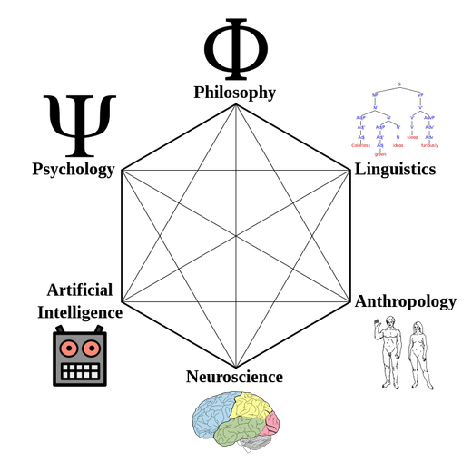

<!-- #region slideshow={"slide_type": "slide"} -->
# Cognitive science
<!-- #endregion -->

<!-- #region slideshow={"slide_type": "slide"} -->
## Introduction

> "Cognitive science is the interdisciplinary, scientific study of the mind and its processes." ([Wikipedia](https://en.wikipedia.org/wiki/Cognitive_science))

<!-- #endregion -->
