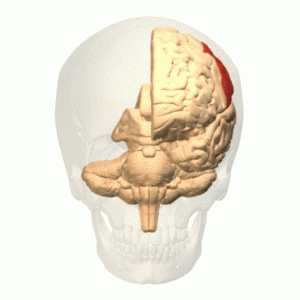

<!-- #region slideshow={"slide_type": "slide"} -->
# The human brain
<!-- #endregion -->

<!-- #region slideshow={"slide_type": "slide"} -->
## Fun brain facts

- Approx. 86 billions neurons in 1.4 kg.
- Volume of around 1260 $\text{cm}^3$ in men and 1130 $\text{cm}^3$ in women.
- Typical power consumption: 20 W.
<!-- #endregion -->

<!-- #region slideshow={"slide_type": "slide"} -->
## Anatomy
<!-- #endregion -->

<!-- #region slideshow={"slide_type": "slide"} -->
### Cerebrum

- Also called telencephalon (*télencéphale*) or endbrain, it is the largest part of the brain.
- It contains the cerebral cortex as well as several subcortical structures, including the hippocampus and the basal ganglia.

<!-- #endregion -->

<!-- #region slideshow={"slide_type": "slide"} -->
#### Cerebral hemispheres

- The cerebrum is divided by the medial longitudinal fissure into two cerebral hemispheres, the right and the left. The right hemisphere controls and processes signals (predominantly) from the left side of the body, and vice versa.
- Each hemisphere has an inner core composed of white matter, and an outer surface composed of grey matter: the cerebral cortex.

<!-- #endregion -->

<!-- #region slideshow={"slide_type": "slide"} -->
#### Cerebral cortex

- There are between 14 and 16 billion neurons in the human cerebral cortex.
- 90% of the cerebral cortex is the six-layered neocortex whilst the other 10% made up of three/four-layered allocortex.
- It plays a key role in attention, perception, awareness, thought, memory, language, and consciousness.
- It is the part of the brain responsible for cognition.
<!-- #endregion -->

<!-- #region slideshow={"slide_type": "slide"} -->
#### Gyri and sulci

The surface of the cerebral cortex folds to create gyri (folds or ridges) and sulci (depressions or grooves) which increase the total area.

<!-- #endregion -->

<!-- #region slideshow={"slide_type": "slide"} -->
#### Cerebral lobes

- The cerebral cortex is generally classified into four lobes: the frontal, parietal, occipital and temporal lobes.
- Together, they comprise the surface of each hemisphere of the cerebrum.

<!-- #endregion -->

<!-- #region slideshow={"slide_type": "slide"} -->
##### Frontal lobe

<!-- #endregion -->

<!-- #region slideshow={"slide_type": "slide"} -->
##### Parietal lobe

<!-- #endregion -->

<!-- #region slideshow={"slide_type": "slide"} -->
##### Occipital lobe

<!-- #endregion -->

<!-- #region slideshow={"slide_type": "slide"} -->
##### Temporal lobe

<!-- #endregion -->

<!-- #region slideshow={"slide_type": "slide"} -->
### Diencephalon

Also called interbrain, the diencephalon (*diencéphale*) consists of the thalamus, hypothalamus, epithalamus and subthalamus.

<!-- #endregion -->

<!-- #region slideshow={"slide_type": "slide"} -->
#### Thalamus

Allowing hub-like exchanges of information, the thalamus has several functions, such as the relaying of sensory signals and the regulation of consciousness, sleep, and alertness.

<!-- #endregion -->

<!-- #region slideshow={"slide_type": "slide"} -->
#### Hypothalamus

- The size of an almond, the hypothalamus links the nervous system to the endocrine system via the pituitary gland.
- Through the release of neurohormones, it regulates certain metabolic processes and activities, such as body temperature, hunger, thirst, fatigue, sleep, and circadian rhythms.

<!-- #endregion -->

<!-- #region slideshow={"slide_type": "slide"} -->
### Brainstem

- The brainstem (*tronc cérébral*) interconnects the cerebrum and diencephalon with the spinal cord.
- It is composed of the midbrain, the pons, and the medulla oblongata.

<!-- #endregion -->

<!-- #region slideshow={"slide_type": "slide"} -->
#### Midbrain

Also called mesencephalon (*mésencéphale*), it is continuous with the thalamus.

<!-- #endregion -->

<!-- #region slideshow={"slide_type": "slide"} -->
#### Pons (*pont*)

<!-- #endregion -->

<!-- #region slideshow={"slide_type": "slide"} -->
#### Medulla oblongata (*moelle allongée*)

<!-- #endregion -->

<!-- #region slideshow={"slide_type": "slide"} -->
### Cerebellum

<!-- #endregion -->

<!-- #region slideshow={"slide_type": "slide"} -->
### Structural view

<!-- #endregion -->

<!-- #region slideshow={"slide_type": "slide"} -->
## Functional view
<!-- #endregion -->

<!-- #region slideshow={"slide_type": "slide"} -->
### Cortical areas

.png)
<!-- #endregion -->

<!-- #region slideshow={"slide_type": "slide"} -->
### Primary somatosensory cortex
<!-- #endregion -->
